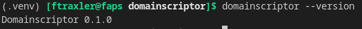

# DomainScriptor

> Ein CLI-Framework, das ausgewählte Active-Directory-Pentest-Werkzeuge unter einer Oberfläche vereint. Automatisiert Prüfungen, normalisiert Ergebnisse in einer zentralen Datenbank und bietet KI-gestützte Analyse und Befehlsvorschläge.



---

## Inhalt

- [Installation](#installation)
- [Konfiguration](#konfiguration)
  - [Tool-Konfiguration](#tool-konfiguration)
  - [KI-Anbindung (.env)](#ki-anbindung-env)
- [Start](#start)
- [Befehle](#befehle)
- [Shortcuts](#shortcuts)
- [KI-Assistent](#ki-assistent)
- [Beispiele](#beispiele)
- [Kompatibilität](#kompatibilität)

---

## Installation

```bash
python -m venv .venv
source .venv/bin/activate
pip install -e .
```

---

## Konfiguration

### Tool-Konfiguration

Für Responder und ntlmrelayx müssen vor dem ersten Einsatz folgende Einstellungen angepasst werden.

**`/etc/responder/Responder.conf`** — SMB und HTTP deaktivieren, damit ntlmrelayx diese Ports nutzen kann:

```ini
SMB  = Off
HTTP = Off
```

**`/etc/proxychains4.conf`** — Port für SOCKS-Proxy auf 1080 setzen:

```ini
socks4  127.0.0.1 1080
```

### KI-Anbindung (.env)

Domainscriptor unterstützt drei KI-Anbieter für den integrierten Assistenten. Eine `.env`-Datei im Arbeitsverzeichnis reicht aus — kein Export von Umgebungsvariablen nötig.

```ini
# Aktiven Anbieter wählen: openrouter | anthropic | openai
AI_PROVIDER=anthropic

# Anthropic
ANTHROPIC_API_KEY=sk-ant-...
# ANTHROPIC_MODEL=claude-haiku-4-5-20251001   # optional, das ist der Standard

# OpenRouter
# OPENROUTER_API_KEY=sk-or-...
# OPENROUTER_MODEL=anthropic/claude-haiku-4-5

# OpenAI
# OPENAI_API_KEY=sk-...
# OPENAI_MODEL=gpt-4o-mini
```

> Manuell gesetzte Umgebungsvariablen haben immer Vorrang vor der `.env`-Datei.

---

## Start

```bash
domainscriptor start
```

Beim ersten Start wird abgefragt:
- Ob initiale Zugangsdaten (Domain, User, Passwort) hinterlegt werden sollen
- Der Ziel-IP-Bereich (wird in `targets.txt` gespeichert)
- Name der Datenbank (oder Auswahl einer bestehenden)

---

## Befehle

Alle Befehle werden innerhalb der interaktiven Shell (`domainscriptor start`) ausgeführt. Tab-Completion ist verfügbar.

| Befehl | Beschreibung |
|--------|-------------|
| `help [adapter]` | Allgemeine Hilfe oder Adapter-spezifische Hilfe |
| `version [adapter]` | Version von Domainscriptor oder eines Adapters |
| `showadapters` | Alle registrierten und verfügbaren Adapter anzeigen |
| `showprocesses` | Laufende Hintergrundprozesse anzeigen |
| `stopprocess <name>` | Hintergrundprozess beenden |
| `runcommand <adapter> [param=wert ...]` | Befehl über einen bestimmten Adapter ausführen |
| `fetch [byIp\|byProtocol\|byToolname\|search] [wert]` | Daten aus der Datenbank abrufen |
| `settings [add\|delete <id>]` | Zugangsdaten verwalten |
| `targets` | Konfigurierte Ziel-IPs anzeigen |
| `relayable` | Relayable Hosts aus `smb_relayable.txt` anzeigen |
| `shortcuts <shortcut> [proxy]` | Vordefinierte Befehlssequenzen ausführen |
| `ai <suggest\|analyze>` | KI-Assistent: Vorschläge oder Schwachstellenanalyse |

### fetch

Liest normalisierte Ergebnisse aus der SQLite-Datenbank.

```
fetch                        → alle Einträge
fetch byIp 192.168.0.1       → nach IP filtern
fetch byProtocol SMB         → nach Protokoll filtern
fetch byToolname nxc         → nach Tool filtern
fetch search zerologon       → Volltextsuche
```

### settings

Speichert Zugangsdaten für automatisierte Checks (Domain, User, Passwort).

```
settings                     → aktuelle Einträge anzeigen
settings add                 → neuen Eintrag hinzufügen
settings delete <id>         → Eintrag löschen
```

---

## Shortcuts

Vordefinierte Befehlssequenzen für häufige Prüfungen.

| Shortcut | Beschreibung |
|----------|-------------|
| `shortcuts get_relayable` | Welche Hosts sind SMB-relayable? → `smb_relayable.txt` |
| `shortcuts get_dc` | Domaincontroller suchen → `dc_ips.txt` (via nxc oder nslookup-Fallback) |
| `shortcuts smb_check [proxy]` | Vollständiger SMB-Sicherheitscheck (11 Prüfungen) |
| `shortcuts ldap_check [proxy]` | Vollständiger LDAP-Sicherheitscheck (10 Prüfungen) |

`smb_check` und `ldap_check` führen die Checks strukturiert mit Kopfzeilen aus:

```
━━━━━━━━━━━━━━━━━━━━━━━━━━━━━━━━━━━━━━━━━━━━━━━━━━━━━━━━━━━━
 [1/11] [SMB] Zerologon  (no auth)
━━━━━━━━━━━━━━━━━━━━━━━━━━━━━━━━━━━━━━━━━━━━━━━━━━━━━━━━━━━━
...
━━━━━━━━━━━━━━━━━━━━━━━━━━━━━━━━━━━━━━━━━━━━━━━━━━━━━━━━━━━━
 SMB scan complete — 11 checks run against 192.168.1.5
━━━━━━━━━━━━━━━━━━━━━━━━━━━━━━━━━━━━━━━━━━━━━━━━━━━━━━━━━━━━
```

**SMB-Checks:** Zerologon, NoPAC, PrintNightmare, SMBGhost, NTLM-Reflection, GPP-Autologin, GPP-Password, Password-Policy, Coerce+, Null Session, Guest Logon

**LDAP-Checks:** ASREPRoasting, User-Descriptions, User-Passwords, Unix-Passwords, ADCS, Domain Trusts, LAPS, LDAP-Signing, Machine-Quota

---

## KI-Assistent

Benötigt einen konfigurierten Anbieter in der `.env` (siehe [KI-Anbindung](#ki-anbindung-env)).

```
ai suggest      → KI schlägt konkrete nächste Domainscriptor-Befehle vor
ai analyze      → KI analysiert alle DB-Findings auf Schwachstellen und Angriffspfade
```

Die KI bekommt als Kontext: verfügbare Adapter, gesammelte Findings aus der DB und die konfigurierte Zieldomain.

---

## Beispiele

**SMB-Share auflisten**
```
runcommand smbclient target=192.168.1.10 share=SYSVOL username=user password=pass command=ls
```

**LDAP-Signing prüfen**
```
runcommand nxc protocol=ldap target=192.168.1.5 module=ldap-checker
```

**Responder starten**
```
runcommand responder interface=eth0 extra_args=-w
```

**ntlmrelayx starten**
```
runcommand ntlmrelayx target_file=smb_relayable.txt
```

**Relayable Hosts ermitteln und direkt SMB-Check durchführen**
```
shortcuts get_relayable
shortcuts smb_check
```

**Domaincontroller suchen (mit Fallback auf nslookup)**
```
shortcuts get_dc
```

**Nmap-Scan**
```
runcommand nmap target=192.168.1.0/24 ports=445,389,88 service_detection=true
```

**KI-Analyse nach einem Scan**
```
shortcuts smb_check
ai analyze
```

---

## Kompatibilität

Getestet auf **Kali Linux 2026.1** mit folgenden Tool-Versionen:

| Tool | Version |
|------|---------|
| impacket-ntlmrelayx | v0.14.0.dev |
| NetExec (nxc) | 1.5.1 |
| Responder | 3.2.2.0 |
| smbclient | 4.23.6 |
| impacket-smbexec | v0.14.0.dev0 |

---

*by Fabian Traxler*
